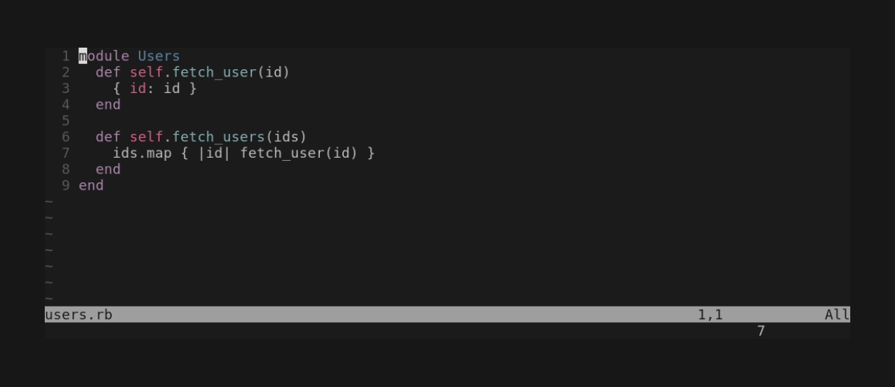
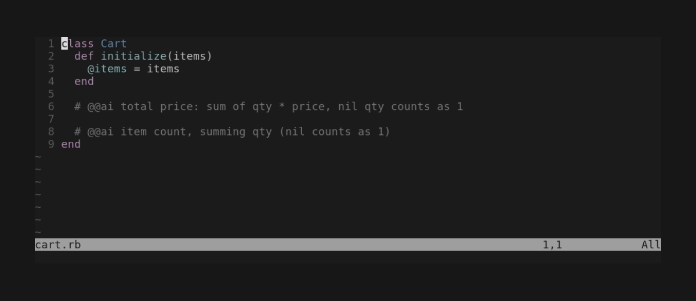
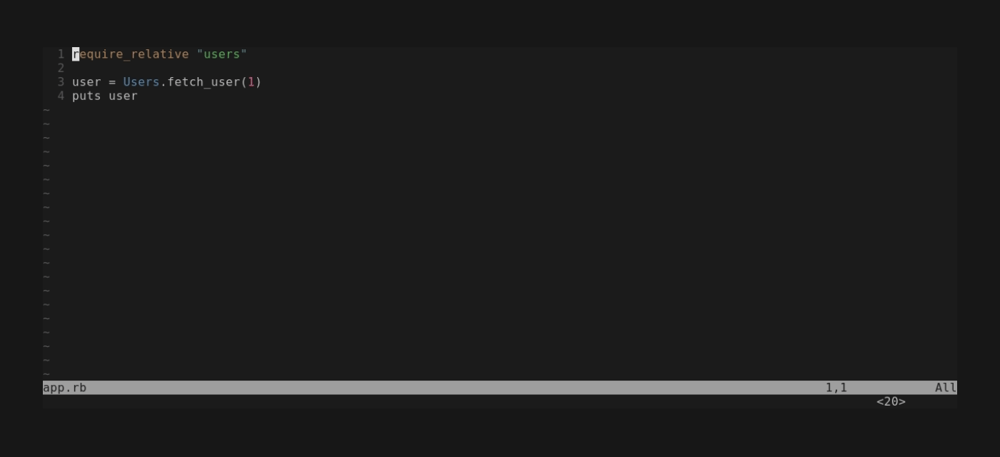

# tsugai.nvim

A Neovim plugin for writing code faster with Claude while keeping your own understanding of the code.
Claude acts only when you ask, and every change is a proposal you review before it lands.

The design lives in [spec.md](spec.md). This is an early proof of concept: in-file templates, chat, edit proposals and command proposals work; multi-file scaffolds do not yet.

## Requirements

- Neovim 0.11+
- Node.js that runs TypeScript directly (22.18+; developed on 26)
- Claude authentication that the [Claude Agent SDK](https://docs.claude.com/en/docs/agent-sdk/overview) accepts (a logged-in `claude` CLI or `ANTHROPIC_API_KEY`)

## Setup

Install it with your plugin manager, with `./build.sh` as the build step. With packer:

```lua
use { "riseshia/tsugai.nvim", run = "./build.sh" }
```

With lazy.nvim:

```lua
{ "riseshia/tsugai.nvim", build = "./build.sh" }
```

The build step installs the sidecar's dependencies, including the Agent SDK, which bundles a platform-specific Claude Code binary, so it has to run on each machine.

Optionally call `setup()`:

```lua
require("tsugai").setup({
  -- Prefix of every tsugai key (default "<Space>f"). The keys below assume the default.
  prefix = "<Space>f",
  -- Preferences appended to Claude's system prompt. They take precedence over the
  -- defaults, which answer in the language of each request.
  instructions = "Always answer in Korean.",
})
```

## Usage

Claude answers only when you ask. Every request blocks the editor while Claude works, showing its progress in a float (or in the chat); `<C-c>` cancels.

| Key | Mode | Action |
|---|---|---|
| `<Space>fa` | normal / visual | Ask in the chat window (visual: about the selection) |
| `<Space>ft` | normal | Toggle the chat window |
| `<Space>fe` | normal | Generate code for every `@@ai` template in the buffer |
| `<Space>fe` | visual | Propose an edit to the selection (or process the `@@ai` templates inside it) |
| `<Space>fu` | normal | Undo the last proposed command you ran |

### Reviewing edits



Edits and generated code appear as ghost text over the code they replace; removed lines turn red.
The key hint and the reason for the hunk under the cursor appear in the command-line area.

| Key | Action |
|---|---|
| `<Space>fy` | Accept the hunk under the cursor and move to the next one |
| `<Space>fn` | Reject the hunk under the cursor and move to the next one |
| `<Space>fr` | Give a follow-up instruction to revise the hunk under the cursor |
| `<Space>fY` | Accept every hunk in the buffer |
| `<Space>fq` | Reject every hunk in the buffer |
| `]g` / `[g` | Next / previous hunk |

Accepting changes the buffer but does not save it. A hunk whose code you edited after it was proposed cannot be accepted; revise or reject it.

### Templates

Write what you want on a line containing `@@ai`, usually in a comment, then press `<Space>fe` in normal mode:

```ruby
class Cart
  # @@ai total price: sum of qty * price, nil qty counts as 1
end
```



Consecutive `@@ai` lines form one template. To process only some templates, select them and press `<Space>fe`; a selection with templates in it skips the instruction prompt.

### Chat and command proposals



Ask in the chat for a rule-based change, e.g. `rename fetch_user to load_user everywhere`. Claude can answer with a command instead of edits: it fills the quickfix list with the targets and shows a card with the command and what each piece means. `<CR>` runs it, `e` puts it in the command line to tweak, `q` cancels. Commands save the files they change (`| update`), so review the result with `git diff`; `<Space>fu` undoes the whole run. Commands that could reach the shell or evaluate code are refused.

## Development

See [DEVELOPMENT.md](DEVELOPMENT.md).
